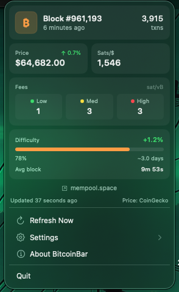
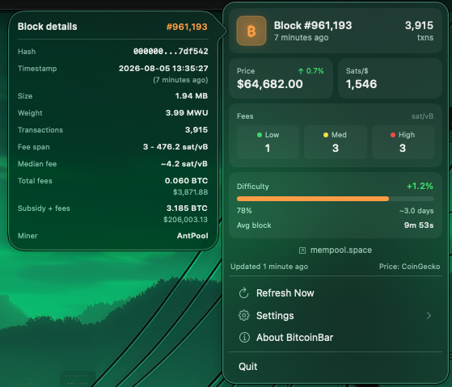
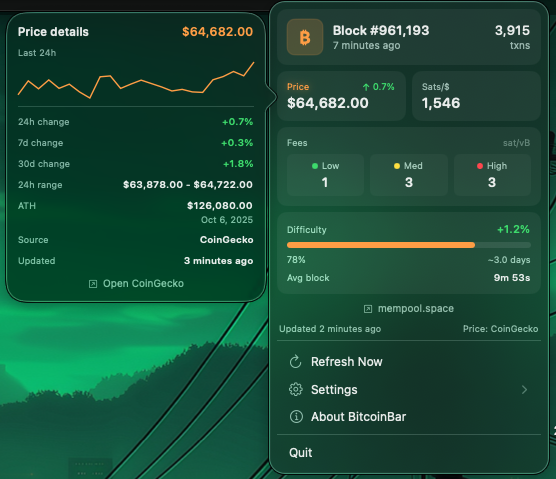

# BitcoinBar

A minimal macOS menu bar app that displays real-time Bitcoin network information.

## Screenshots

<p align="center">
  
</p>

<p align="center">
  
  
</p>

## Features

- 📊 Live Bitcoin block height and stats with a details popover
- 💰 Current BTC price, 24h change, and a price details popover
- 🔁 Sats-per-fiat display with tap-to-cycle currencies (USD, EUR, GBP, JPY, CAD, AUD, CHF, CNY, HKD, SGD)
- ⚡ Network fee recommendations
- ⏱️ Average block time, difficulty progress, and retarget estimate
- 🔄 Manual or automatic refresh intervals (5, 10, or 15 minutes)
- 🎨 Compact card-based menu layout with menu bar icon options

## Tips

- Click the block card to see hash, time, size/weight, fees, and miner details.
- Click the price card to see a 24h sparkline, 24h/7d/30d changes, range, and ATH.
- Click the sats card to cycle fiat currencies.

## Download

**[Download Latest Release](https://github.com/nmorton13/bitcoin_menu_bar/releases/latest)**

### System Requirements

- macOS 15.0 (Sequoia) or later
- Apple Silicon (ARM64)

## Installation

1. Download from the [Releases](https://github.com/nmorton13/bitcoin_menu_bar/releases) page
2. Unzip and drag `BitcoinBar.app` to Applications (recommended) or run it from a folder of your choice
3. Double-click to launch (notarized build)
4. The Bitcoin symbol (₿) will appear in your menu bar

## Building from Source

### Prerequisites

- macOS 15.0+
- Xcode Command Line Tools
- Swift 6.0+

### Build Steps

```bash
# Clone the repository
git clone https://github.com/nmorton13/bitcoin_menu_bar.git
cd bitcoin_menu_bar

# Build the app
./Scripts/build.sh

# Run the app
open BitcoinBar.app
```

## Data Source

- Most Bitcoin data is fetched from the public [mempool.space API](https://mempool.space/docs/api) over HTTPS.
- BTC price and 24h change are fetched from [CoinGecko](https://www.coingecko.com/en/api).
- No API keys or personal data are used—just anonymous requests for the latest blocks, mempool stats, price, fees, and difficulty info.

## Privacy

- The app makes anonymous HTTPS calls to mempool.space for network stats and never sends any personal data.
- No accounts, tracking, or analytics. Settings (refresh interval, icon style, launch-at-login) are stored locally in `UserDefaults`.
- If you’re on a hostile network and want extra protection, consider using a trusted DNS/VPN. Certificate pinning is not enabled. 

## License

MIT License - See [LICENSE](LICENSE) file for details

## Credits

Inspiration came from [CodexBar](https://github.com/steipete/CodexBar) by Peter Steinberger.

## Author & Links

- Contact: X [@nmorton](https://x.com/nmorton)
- Projects: [hodljuice.app](https://hodljuice.app) (web podcast player), [thebtcbrew.com](https://thebtcbrew.com) (podcast & newsletter)

## Support

If you find this app useful, consider:
- ⭐ Starring this repository
- 🐛 [Reporting issues](https://github.com/nmorton13/bitcoin_menu_bar/issues)
- 💡 [Suggesting features](https://github.com/nmorton13/bitcoin_menu_bar/issues)
